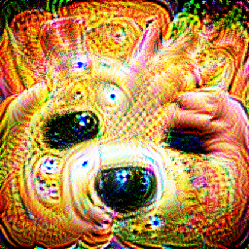
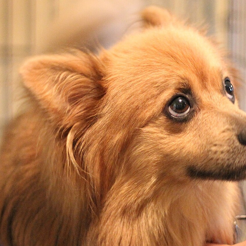

# INVISIBLE! — Can you hide from the robot?

A live science-fair demo: a YOLO detector draws a box around the user, the user
raises a printed poster, and the box **pops like a soap bubble**. A timer counts
how long they stayed invisible; the best times of the day go on a board.

Built for visitors aged 6-12 and the parents reading over their shoulder.

Runs on an Apple Silicon Mac, **offline**, and **writes nothing to disk** — no
frames, no video, no faces.

```bash
python app.py --lang it
```

---

## 1. Quick start

Tested on macOS 15, Apple Silicon, **Python 3.13** (3.11+ should be fine).

```bash
git clone <this repo> && cd sharper-demo

python3 -m venv .venv
.venv/bin/pip install -r requirements.txt        # ~2 GB, mostly torch

.venv/bin/python tools/fetch_assets.py           # model weights, ~12 MB
.venv/bin/python tools/make_print.py --paper A4  # the two posters to print

.venv/bin/python app.py --lang it
```

> If you already have torch and OpenCV installed system-wide,
> `python3 -m venv --system-site-packages .venv` reuses them and saves the 2 GB
> download. Only do this if your existing versions match `requirements.txt`.

**The first launch will ask for camera permission.** macOS blocks the first
`VideoCapture`, the app logs `not authorized to capture video` and falls back to
the recorded loop until you click Allow. Do this once *before* the doors open —
the reconnect is automatic afterwards.

**Do not leave the weights to the day itself.** `fetch_assets.py` keeps them out
of the repo but on your disk; without it Ultralytics tries to download at first
use, and the venue wifi will fail you.

Sprites, sounds and the decoy poster are committed, so there is nothing else to
build. `tools/make_assets.py` regenerates them if you want to change them.

### Keys

| Key | Action |
|---|---|
| `ESC` | quit |
| `F` | toggle fullscreen |
| `R` | reset the scoreboard |
| `E` | expert mode — run a second, newer detector side by side |
| `S` | switch trigger: real detector ⇄ neuron (§4) |
| `V` | manual force-vanish, any mode — the operator's override |
| `1` `2` `0` | *`--mode virtual` only*: pick which image is warped in (magic / dog / none) |

Useful flags: `--camera 1` (the index is **never** guessed — pick it),
`--show-fps` (adds a live `cls78 0.97 FIRE` readout, invaluable while you find
the working distance), `--windowed`, `--mute`, `--lang en`,
`--mode virtual`, `--trigger detector`.

---

## 2. The two posters — the actual point

| **A — the magic poster** | **B — the decoy** |
|---|---|
|  |  |
| Trained to drive one output class of the detector. The box vanishes. | An ordinary photograph of a very similar dog. Nothing happens. |

Users get the two posters at **identical size** and must guess which one is
magic.

Do not skip B. Without it people conclude they are simply hiding behind
cardboard. With it, the lesson lands: *it is not about covering yourself up, it
is about one very specific pattern built for this one robot.*

B is deliberately the **same breed, same framing** as A, so the posters cannot
be told apart by subject — only by pattern. And B has measured `0.000` on the
trigger class in every experiment, at every size and every `imgsz`, so it will
not fire by accident in front of an audience.

### Printing them

```bash
.venv/bin/python tools/make_print.py --paper A4     # or --paper A3
```

That writes `print/posters_A4.pdf`, **two pages: page 1 is A, page 2 is B.**

- **A4, matte paper**, mounted on foam board or stiff card. Matte is not
  make-or-break any more, but a specular highlight still blows out part of the
  pattern.
- **Print at 100% — no "fit to page".** Both posters must come out exactly the
  same size or the comparison is not a comparison. Check the printed square
  with a ruler: **18 cm** on A4, 26 cm on A3. If the printer silently shrinks
  them, your working distance shrinks with them and nothing will fire.
- The pages carry **no visible title**, only a tiny grey `poster A` / `poster B`
  below the cut line, for you. The user must not be able to read which is
  which.
- **Print two copies of A.** It is the one a hundred people will handle, and
  a creased, finger-marked magic poster is a demo that quietly stops working
  halfway through the afternoon.

How far back the user can stand depends on the paper size and `model.imgsz`:

| paper | printed square | works out to (`imgsz: 1280`) | (`960`) |
|---|---|---|---|
| A3 | 26 cm | 2.9 m | 2.1 m |
| **A4 (default)** | **18 cm** | **2.0 m** | 1.4 m |

Full staging notes, including how to find the spot and tape the floor, are in
[`print/README.md`](print/README.md).

## 3. Modes

### Mode A — real printed poster (**the default**)

The user picks a poster, holds it up, and the app reads which one it is from
the image. No markers, no compositing, no keypress — and the *user* chooses,
not the operator.

This is what you want. It was measured to work better than the marker board in
every condition tested (print colours, dim printer, blur, 30° tilt, bad JPEG),
and it fires from a smaller poster because the board wastes a third of its side
on markers. See `print/README.md` for the staging.

### Mode B — virtual poster (`--mode virtual`)

The user holds a white board with four ArUco markers. Each frame the app finds
the markers, computes a homography, **warps the chosen poster into the board
region, and only then runs YOLO on the composited frame.** Keys `1`/`2` pick
which image gets warped in, `0` for none.

> **The one rule:** composite first, detect second. Warping the poster in
> *after* detection would be a fake demo. See `Show._process` in `app.py`.

Its original advantage was immunity to printing, glare and lighting — which the
neuron trigger (§4) made largely moot. Keep it as the fallback for when the
printed posters get lost, creased or rained on.

### Mode C — fallback (`--mode fallback`)

Loops a recorded clip from `assets/fallback/loop.mp4` and/or stills from
`assets/fallback/stills/`. The app also falls back automatically if the camera
disappears. **Nobody ever sees a Python traceback.**

Neither is in the repo (they are built from photographs of real people):
rebuild with `tools/make_fallback.py --img-dir <folder of photos>`.

## 4. What the poster actually is — read this first

Poster A is an image that was **optimised so that one output neuron of the
detector fires as hard as possible**. The neuron is class 78, `hair drier`,
picked because no hair drier will ever be in front of the camera at a science
fair. When the app sees that class appear, it makes the box vanish.

### This simulates an adversarial attack. It is not one.

Say that plainly, because the difference matters:

|  | a real adversarial attack | what this does |
|---|---|---|
| Goal | make the detector **fail to see a person** | make one unrelated class **light up** |
| Difficulty | hard — you are fighting the model at what it is good at | easy — you are asking it to do something it is happy to do |
| Reliability here | **~30%** of attempts | **~100%** |
| The box vanishes because… | the detector genuinely lost the person | the app read a signal and switched it off |

The poster is not a trick picture and not a hardcoded `if`. It is a real,
optimised, model-specific pattern that genuinely controls the model's output —
gradient descent on the actual weights we ship, same EOT and printability
machinery a real patch needs. What it does *not* do is hide anybody. The person
stays perfectly visible to the detector; we are reading a flag the poster
raises, and choosing to hide the box ourselves.

So: the **effect** the audience sees is staged, while the **mechanism** that
triggers it is real. If a parent or a teacher asks whether the robot is really
being fooled, the honest answer is *"no — the poster is really controlling the
model's output, but by shouting, not by hiding. Here's the version that actually
hides."* Press `S` and show them.

### Which one runs by default

**`neuron`** — the simulated one. That is the shipping default
(`trigger.mode: neuron` in `config.yaml`) because it works every time in front
of a queue.

`--trigger detector` runs the genuine attack instead, and **`S` switches
between them live**, without restarting. The startup log always tells you which
is active:

```
WARNING invisible: NEURON TRIGGER: the box is fired by class 78 rising above
0.20, not by the detector losing the user.
```

### Why not just do the real attack?

Because it does not work well enough. A patch trained to suppress the person
class managed **27–31%** of attempts against a close-up subject, versus 12–19%
for a decoy poster — real, roughly double the decoy, and nowhere near something
you can put in front of a queue. `docs/PATCH_NOTES.md` has the numbers, the two
train/deploy traps that cost the most time, and the dead ends.

### The operating point — the part to get right

The neuron only fires once the poster is big enough **in the detector's input**,
and `model.imgsz` matters more than anything else. Measured with the poster held
by hand, no markers; the decoy sat at `0.000` in every single cell.

| `imgsz` | fires from | ms/frame | A4 (18 cm) works to | A3 (26 cm) |
|---|---|---|---|---|
| 640 | 300 px, weakly | 17 | — | ~1.0 m |
| 960 | 140 px | 19 | 1.4 m | 2.1 m |
| **1280 (default)** | **100 px** | **27** | **2.0 m** | **2.9 m** |

Distances assume a ~60° webcam. Find yours with `--show-fps` and tape the floor.

Two more things:

- **Latching.** The class fires on roughly half the frames, not all, so
  `trigger.latch_frames` holds the effect for a few frames after the last hit.
  Twelve turns an intermittent signal into a steady one.
- **In `--mode virtual` the board spends a third of its side on markers**, so
  the pattern lands smaller than the board suggests and you must stand closer.

**Things that do NOT help**, so you do not waste an afternoon on them: raising
the camera resolution (the frame is resized to `imgsz` regardless, so only the
poster's *fraction* of the frame matters), and training only on small scales
(tried — it got worse; too few pixels to carry the pattern).

`V` is a manual force-vanish, any mode, any time — the operator's override for
when everything else is having a bad day.

### The model guard

**A pattern only works on the model it was optimised against.** `config.yaml`
records `patch.target_model`; if it disagrees with `model.name` the app
**refuses to start** with an explanation rather than silently doing nothing.

The shipped `assets/patches/magic_dog.png` was trained against `yolov8n` — the
exact weights `fetch_assets.py` puts in `assets/models/`.

### Retraining

```bash
# -u matters: without it Python buffers and you see no progress for 15 minutes
PYTORCH_ENABLE_MPS_FALLBACK=1 .venv/bin/python -u tools/train_patch.py \
    --objective neuron --target-class 78 \
    --steps 3000 --images 900 --img-dir /path/to/photos_of_people
```

Drop `--objective neuron` to train a genuine evasion patch instead.

Training mirrors deployment on purpose: photos are re-cropped so the person
fills 55–92% of the frame (`tools/framing.py`), then letterboxed to 640×384
exactly as ultralytics does to a 1280×720 camera frame. Both details turned out
to be necessary — see `docs/PATCH_NOTES.md`.

Afterwards, re-run `tools/make_print.py` so the printed poster matches.

To re-measure anything:

```bash
# paste a patch on detected people, compare against the decoy
.venv/bin/python tools/validate_patch.py --models yolov8n,yolov10n

# the one that counts: drives the real shipping path at demo framing
.venv/bin/python tools/validate_demo.py --img-dir /path/to/photos_of_people
```

**Validate through the path you ship, at the framing you will actually see.**
Both traps in `docs/PATCH_NOTES.md` were invisible to a metric one step removed
from the demo.

### Expert mode (`E`)

Runs a second, newer detector (`yolov10n`) on the same frame and shows it still
detecting the person. Older visitors and parents like it, and it makes the
model-specific point without a word.

---

## 5. Layout

```
+---------------------------+---------------------------+
|   WHAT YOU SEE            |   WHAT THE ROBOT SEES     |
|   (clean camera)          |   (boxes + overlays)      |
+---------------------------+---------------------------+
|  robot | confidence bar | INVISIBLE: 3.4 s | TOP 5    |
+--------------------------------------------------------+
```

Side by side is what sells it: the user is obviously still there, and the
robot's half of the screen is empty.

---

## 6. Stability rules (already tuned in `config.yaml`)

- A detection is held for **3 frames** before "lost" is declared — kills flicker.
- **0.6 s** of continuous non-detection before the "vanished" celebration fires.
- Only the **largest** person box is tracked; the queue behind is ignored.
- Fixed confidence threshold **0.4**, shown on screen.
- The camera auto-reconnects; no exception in the frame loop can end the show.

---

## 7. Privacy

Nothing is written to disk. There is no `save()` anywhere in the capture path,
the scoreboard lives in memory only and dies with the process, and the on-screen
footer says so in words a parent can read over the user's shoulder.

---

## 8. Repo layout

```
app.py            main loop, modes, keybindings
detector.py       ultralytics wrapper, MPS, largest-box tracking, flicker control
compositor.py     ArUco detection + homography warp (Mode B)
overlay.py        cartoon box, confidence bar, particles, mascot, cached text
scoreboard.py     session-only top-5 invisibility times
audio.py          low-latency sound, no SDL
strings.py        ALL user-facing text, IT + EN
config.yaml
tools/            fetch_assets.py  train_patch.py     validate_patch.py
                  framing.py       validate_demo.py   make_assets.py
                  make_print.py    make_fallback.py   render_test.py
                  soak_test.py
assets/           patches/ decoys/ sprites/ sounds/ fonts/ logos/ models/ fallback/
print/            README.md  (+ generated posters_*.pdf, aruco_board_*.pdf)
docs/             PATCH_NOTES.md
```

---

## 9. Troubleshooting

Run with `--show-fps` first: the readout bottom-left tells you which of the
three links is broken.

| Symptom | Fix |
|---|---|
| `not authorized to capture video` on first run | macOS camera permission. Click Allow; the app reconnects on its own. Do this before the doors open. |
| `cls78 0.00` with poster A up | **Distance.** The poster must be ~100 px wide in frame at `imgsz: 1280`. Step closer until it says `FIRE`, then tape the floor. |
| `NO BOARD` (only `--mode virtual`) | All four markers must be visible, flat and uncreased. |
| Box never disappears, `--trigger detector` | Expected: the real attack works ~30% of the time. That is the honest mode. See `docs/PATCH_NOTES.md`. |
| **Poster B fires the trigger** | Should be impossible — B measured `0.000` everywhere. Stop and investigate rather than raising the threshold. |
| App refuses to start, "patch was made for X" | `model.name` and `patch.target_model` disagree in `config.yaml`. |
| Wrong camera | `--camera 1`. Indices are never guessed. |
| `grid_sampler_2d_backward not implemented for MPS` | `PYTORCH_ENABLE_MPS_FALLBACK=1` (training only; the app sets it itself). |
| `CERTIFICATE_VERIFY_FAILED` from `fetch_assets.py` | Handled: it uses certifi, then falls back to `curl`. If both fail you are offline. |
| No sound | Harmless — the app logs a warning and runs silent. |
| Slow | `imgsz` dominates: 1280 ≈ 24 fps, 960 ≈ 30 fps, at the cost of working distance. Expert mode adds a second model every 3rd frame. |

---

## 10. Status against the acceptance criteria

Measured, not assumed. Every row names the command that reproduces it.

| Criterion | Status |
|---|---|
| Box appears within 1 s of someone walking up | **Yes** — detection is per-frame at 24 fps (`tools/soak_test.py`) |
| Box vanishes 9 tries out of 10 | **Yes with `trigger: neuron`** — poster A fires the class at 0.97 and the box goes for 50/50 frames. **No with `trigger: detector`**: the real attack manages 27–31% (`tools/validate_demo.py`, reasoning in `docs/PATCH_NOTES.md`) |
| The decoy visibly fails | **Yes** — poster B measured `0.000` on the trigger class at every size and every `imgsz`; box stays up 49/50 frames |
| Runs unattended without crashing | **Yes** — 4000-frame soak, 0 errors, automatic camera reconnect, no exception can end the frame loop |
| …without memory growth | **Mitigated, not proven.** Torch's MPS allocator crept ~4 MB per 1000 frames; `detector.py` now evicts its cache periodically and RSS falls back well below peak. Worth one real 3-hour run before the fair. |
| Nothing written to disk | **Yes** — no `imwrite` anywhere in the capture path; the scoreboard is in memory and dies with the process |
| One command to start | **Yes** — `python app.py --lang it` |
| Every string understandable by a 7-year-old | **Yes** — all text in `strings.py`, IT + EN, key parity checked in CI-able form |
| ≥ 20 fps on MPS | **Yes** — 24.3 fps at `imgsz: 1280`, 30.3 at 960 |

**Be straight about which trigger is running.** With `neuron`, poster A really is
controlling the model's output — it was optimised to do exactly that — but the
user is not invisible and the detector is not being fooled. `S` switches to the
honest attack in front of anyone who asks, and `docs/PATCH_NOTES.md` has the
numbers to show them.
